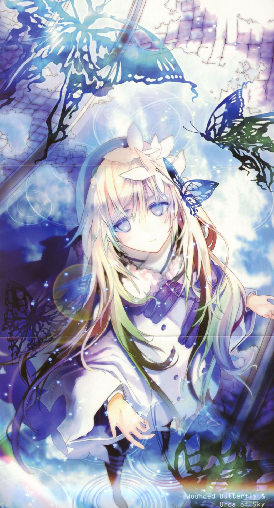

### 你好，轻小说 👋

<!--

**Here are some ideas to get you started:**

🙋‍♀️ A short introduction - what is your organization all about?
🌈 Contribution guidelines - how can the community get involved?
👩‍💻 Useful resources - where can the community find your docs? Is there anything else the community should know?
🍿 Fun facts - what does your team eat for breakfast?
🧙 Remember, you can do mighty things with the power of [Markdown](https://docs.github.com/github/writing-on-github/getting-started-with-writing-and-formatting-on-github/basic-writing-and-formatting-syntax)
-->

「一言为定。我们一起飞吧。飞到天空的尽头——」
一个岛屿漂浮在雾上的世界。
这段故事描述「武装邮务商」的少年威尔，以及不可思议的少女洁西卡，
两人堵上性命，飞跃魔物「雾妖」栖息的雾海，寄送写入人们思绪的「封书」。
飞行技术差，不会预判风势的威尔，以及因为一件事故而对天空产生恐惧的洁西卡；两人必须互相截长补短才能飞行。
但他们还是向往着天空，挑战杀机四伏的雾——为了探索「天空的底层」。
——搭上双人座「翼舟」，享受在云上疾驰的畅快冒险幻想曲。

 

《[**不会飞的蝴蝶与天空之𩾇**](https://zh.moegirl.org.cn/%E4%B8%8D%E4%BC%9A%E9%A3%9E%E7%9A%84%E8%9D%B4%E8%9D%B6%E4%B8%8E%E5%A4%A9%E7%A9%BA%E4%B9%8B%F0%A9%BE%87)》（日语：**飛べない蝶と空の鯱**）是由手岛史词创作，鹈饲沙树插画的轻小说。
本文引自[萌娘百科](https://zh.moegirl.org.cn)，文字内容默认使用《知识共享 署名-非商业性使用-相同方式共享 3.0 中国大陆》协议。

